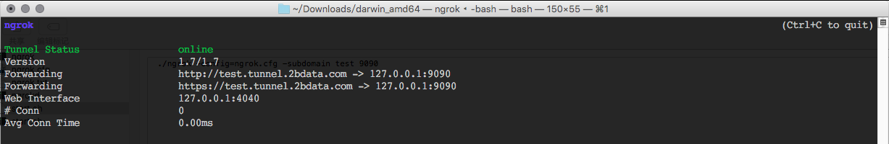
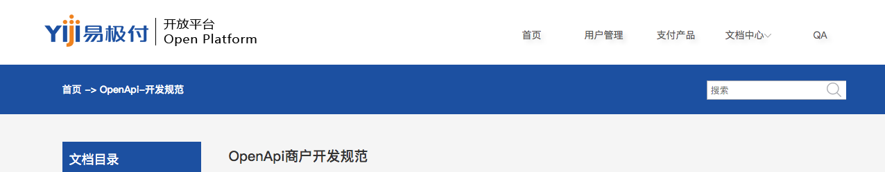
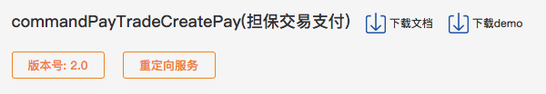

# 关于易极付接口调试总结
### version 1.0
## 第一、调试环境
### 1.调试运行环境
+ Tomcat Server
+ Spring + MVC
+ Maven
+ 易极付SDK，主要是jar包
### 2.辅助支撑环境
+ ngrok (用来把内网IP，映射到外网，生成外部能够直接访问的域名)
+ 运行参数： ./ngrok -config=ngrok.cfg -subdomain test 9090
+ 运行状态：

+ -config参数是配置文件。要和运行文件同一个目录。
+ -subdomain参数是二级域名。可以随便起一个。例如test。
+ 9090参数是指本地tomcat server运行的端口号
### 3.接口文档
+ 首先阅读：
  + [接口文档][3dd8ec9c]——主要要理解通讯的三种不同模式：（1）同步；（2）异步；（3）跳转。以及各自的处理过程。
+ 接下来查阅每一个接口的说明文档：
  + 在文档的搜索框当中输入要查询的接口英文名称，可以检索到具体的接口说明。
  + 
+ 在阅读具体接口说明时，要注意接口的类型，如下图：
  + 
  + 版本号请选择最高的！
  + 重定向服务是指调用该接口时采用的通讯模式。（即跳转模式）
  + demo代码过时了，不需要下载。
### 4.参数环境
+ 测试环境地址：http://openapi.yijifu.net/gateway.html
+ 测试商户(partnerId)：20160612020000748352
+ 测试安全秘钥：fbeb22c3ac9b1928ff175ab6dce70220
### 5.调试接口列表

|接口中文|接口英文|
|-------  |:-------------|
| 创建担保交易订单 |  commandPayTradeCreate       |
| 担保交易确认打款 |  commandPayConfirm       |
| 担保交易支付 |  commandPayTradeCreatePay       |
| 开通支付账户 |  openPaymentAccount       |
| 注册会员 |  ppmNewRuleRegisterUser       |
| 交易查询 |  multipleTradeMergeQuery       |
| 钱包 |  wallet       |
| 退款 |  fastPayTradeRefund       |
| 通用跳转绑卡服务 |  commonRedirectBindCard       |

## 第二、接口业务说明
### 1.注册会员（ppmNewRuleRegisterUser）
+ 业务场景：
  + 平台买家开通注册账户即可。
+ 业务要求：
  + 医德帮诊所用户初期都视同买家用户处理。
  + 支付会员注册前可以先开通注册会员。这样可以在体验上好一些。
+ 涉及周边工作：
  + 医德帮2.0存量用户后台批量开通注册
  + 医德帮2.0用户注册成功后，后台单一开通

### 2.开通支付账户（openPaymentAccount）
+ 业务场景：
  + 平台卖家开通必须支付账户。
  + 支付账户又分为个人、企业、个体工商户。
+ 业务要求：
  + 医德帮代理商用户都需要作为卖家在易极付开通支付账户。
  + 支付会员注册前可以先开通注册会员。这样可以在体验上好一些。
  + 医德帮平台设计开发信息采集页面，先存储在平台，然后调用接口传给易极付。
+ 涉及周边工作：
  + 代理商端口需要增加功能页面，开通支付账户，上传资料

### 3.通用跳转绑卡服务（commonRedirectBindCard）
+ 业务场景：
  + 平台卖家在开通支付账户后，应该执行绑定银行卡操作（企业用户需要绑定企业提现卡）。
+ 业务要求：
  + 在代理商开通支付账户（接收到异步消息通知）后，应该提示进行绑定银行卡
  + 通过提示可以导航到绑定银行卡页面
+ 涉及周边工作：
  + 代理商端口需要收取支付账户的异步通知
  + 代理商端口需要增加功能页面，支付账户银行卡管理

### 4.创建担保交易订单（commandPayTradeCreate）
+ 业务场景：
  + 如果使用合并支付场景（多订单一次支付），需要创建多个担保交易订单。
+ 业务要求：
  + 需要支持多订单合并支付场景
+ 涉及周边工作：
  + 业务系统需要明确原子级别订单
  + 需要明晰合并支付的结果，并反映到原始的原子订单状态

### 5.担保交易支付（commandPayTradeCreatePay）
+ 业务场景：
  + 单笔支付场景，就可以直接调用这个接口而不用先创建交易订单。
  + 合并支付场景，需要传入多个tradeNo，用逗号分隔，来进行合并支付。
+ 业务要求：
  + 需要支持多订单合并支付场景
  + 需要支持但订单支付场景
  + 对于收银台调用时，必须采用快捷支付（费率原因）
+ 涉及周边工作：
  + 业务系统需要明确原子级别订单
  + 需要明晰合并支付的结果，并反映到原始的原子订单状态

### 6.退款（fastPayTradeRefund）
+ 业务场景：
  + 在清分之前，可以进行退款
  + 退款会涉及手续费，这个要在支付通道上配置体现
  + 如果退款业务频繁，需要从业务流程上重新设计来避免高额的手续费，目前先不考虑
+ 业务要求：
  + 退款只能发生在清分之前
+ 涉及周边工作：
  + 在支付平台，支付订单和退款订单分别设置状态
  + 业务系统反映到原始的原子订单状态

### 7.担保交易确认打款（commandPayConfirm）
+ 业务场景：
  + 由业务系统触发清分操作
  + 清分规则是事先配置好的
+ 业务要求：
  + 清分的触发条件由业务系统控制
  + 清分只负责分佣金到一个或者多个支付账户（明医众禾账户：partnerId）
  + 在没有指定confirmAmount的时候缺省认为一次清分，那么余额将会打入sellerId所在支付账户
+ 涉及周边工作：
  + 清分规则配置

### 8.钱包（wallet）
+ 业务场景：
  + 支付账户提现的入口（绑定银行卡）
  + 易极付可以后台通过易极付运营岗位来配置来进行自动提现（绑定了银行卡）
+ 业务要求：
  + 支持钱包页面的调入
  + 运营建群，前期可以考虑手动配置自动提现（前提是绑定了银行卡）
+ 涉及周边工作：
  + 查询用户的资金账户开通以及银行卡绑定情况

### 9.交易查询（multipleTradeMergeQuery）
+ 业务场景：
  + 根据业务内部流水号来查询第三方支付平台业务状态
+ 业务要求：
  + 按照业务订单类型来记录并查询。例如：开户、支付、退款、清分等
+ 涉及周边工作：
  + 财务模块查询页面
  + 后期考虑开发自动对账功能

## 第三、注意事项

  [3dd8ec9c]: https://apidoc.yiji.com/website/develop_doc.html "接口文档"
