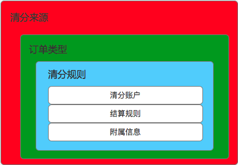
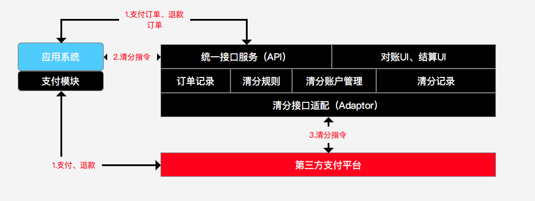

# 关于平台清分逻辑的设计
# 一、业务定义
+ 1.1 清分的定义：
  - 清分是指在撮合交易当中，资金存放在第三方监管账户当中，清分平台根据指令对交易各方执行金额分配的过程。

+ 1.2 清分的对象：
  - 清分的对象指已经收单（收到款）的订单。根据不同的订单类型，可以进行多种规则的清分动作。

+ 1.3 清分指令：
  - 是指撮合平台在满足交易条件后（平台逻辑），通过指令协议向第三方支付平台下达一定规则的清分命令。前提条件：平台业务逻辑完成；必备条件：订单号，清分账户，清分规则。清分给各个账户的总额不能超过订单总额

# 二、关键业务要素说明
+ 2.1 清分对象
  + 输入：订单(区分订单类型，付款人【买家】，收款人【卖家】，货物，订单金额)
  + 输出：账户（收款人账户【可以多个】）

+ 2.2 清分规则
  + 2.2.1核心元素：
    + 1.收单方式

|收单方式|说明|
|-------  |:-------------|
| 快捷支付 |  支持大多数银行卡的网上支付       |
| 银联支付 |  比快捷支付支持的银行多，但是费率较高       |
| 微信支付 |  腾讯的支付       |
| 支付宝 |  阿里巴巴的支付       |

    + 2.第三方支付通道

|第三方支付通道|说明|
|-------  |:-------------|
| 通道一 |  与医统天下合作的支付通道       |
| 通道二 |  自营业务的支付通道       |

    + 3.收单费率

|第三方支付通道|收单方式|费率|
|-------  |:-------------|:-------------|
| 通道一 |  快捷支付       | 千分之三|
| 通道一 |  银联支付       | 千分之五|
| 通道一 |  微信支付       | 千分之四点五|

    + 4.订单

|清分订单来源|说明|
|-------  |:-------------|
| 医德帮诊所管理系统 |  诊所软件相关增值收费       |
| 医德帮商城（诊所端）|  医德帮药品供应链平台       |
| 医德帮商城（代理端）|  医德帮药品供应链平台       |
| 医德帮商城（厂商）|  医德帮药品供应链平台       |
| 医德帮医疗平台     |  为了支撑未来的远程会诊收费  |
| 医德帮辅助诊断系统 |  为了支撑未来的惠美辅助诊断系统收费  |

|清分订单类型|说明|
|-------     |:------------- |
|线上支付收单  |正常的线上支付订单|
|线下收款收单  |未来线下收款的线上收单入口形成的支付订单|
|金融放款订单  |金融服务公司针对赊销订单的放款订单|
|金融还款订单  |诊所针对赊销订单进行还款的支付订单|

  + 5.账户

|账户类型|说明|
|-------     |:------------- |
|终端账户  |诊所老板的账户|
|代理商账户  |药品经销企业的账户或者居间人个人账户|
|供货商账户  |药品生产企业的账户|
|金融服务公司账户  |金融公司用来收取还款的账户|
|医疗服务提供方账户  |支持远程会诊等医疗服务提供方账户|
|增值服务提供方账户  |其他提供增值服务方的账户|

  - 第三方支付都有本身体系的ID来管理账户。因此，所有的相关收款方首先要在第三方支付开通账号才可清分。

  + 2.2.2 规则
    + 1.结构

    - 2. 清分账户
      - 结算规则是针对清分账户设定的，一个清分账户对应一个结算规则
      - 一套清分规则下，可以存在一个或多个清分账户
    - 3. 结算规则
      - （1）核心要素
        - 结算类型
          - 订单总金额结算
          - 根据订单内商品结算
          - 固定金额结算
        - 结算值(针对订单总金额结算和固定金额结算)
          - 百分比
          - 固定值（单位：元，精确到：分）
        - 结算因子（根据订单内商品结算）
          - 输入：结算账户、订单
          - 输出：结算金额（单位：元；精确到：分）
        - 结算原则
          - 总数不变原则（不管如何结算，各方结算金额的合计不能超过订单金额总数）
          - 业务控制原则（清分的指令由各业务系统发出，是否满足清分的前置条件由各业务系统保证）

    - 2.2.3 清分记录
      - 清分记录是为了和第三方支付平台进行对账而形成的清分流水记录
      - 系统的支付流水记录是为了财务对账形成，一条支付流水记录会存在一条或者多条清分记录
      - 清分记录构成：
        - 1.清分订单号
        - 2.清分账户
        - 3.清分金额
        - 4.清分时间属性
        - 5.清分其他属性
        - 6.清分科目

    - 2.2.4 清分对账
      - 1.收单对账
        - 场景：收单对账是财务每天对于各个系统的支付订单和收款账户进账情况的核对工作。
        - 周期：一般以日为单位
      - 2.清分对账（与第三方支付）
        - 场景：与第三方支付平台清分对账是针对各清分订单最终清分情况的双方核对。
        - 周期：一般以周或者月为单位
      - 3.结算对账（与交易相关方）
        - 场景：是财务对于交易参与各方的结算情况的核对
        - 周期：一般以月为单位
  + 3.清分过程

