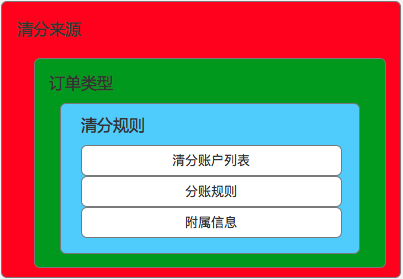

# 关于平台清分逻辑的设计
# 一、业务定义
+ 清分的定义：
  - 清分是指在撮合交易当中，资金存放在第三方监管账户当中，清分平台根据指令对交易各方执行金额分配的过程。

+ 清分的对象：
  - 清分的对象指已经收单（收到款）的订单。根据不同的订单类型，可以进行多种规则的清分动作。

+ 清分指令：
  - 是指撮合平台在满足交易条件后（平台逻辑），通过指令协议向第三方支付平台下达一定规则的清分命令。前提条件：平台业务逻辑完成；必备条件：订单号，清分账户，清分规则。清分给各个账户的总额不能超过订单总额

# 二、关键业务要素说明
+ 清分对象
  + 输入：订单(区分订单类型，付款人【买家】，收款人【卖家】，货物，订单金额)
  + 输出：账户（收款人账户【可以多个】）

+ 清分规则
  + 核心元素：
    + 收单方式

|收单方式|说明|
|-------  |:-------------|
| 快捷支付 |  支持大多数银行卡的网上支付       |
| 银联支付 |  比快捷支付支持的银行多，但是费率较高       |
| 微信支付 |  腾讯的支付       |
| 支付宝 |  阿里巴巴的支付       |

    + 第三方支付通道

|第三方支付通道|说明|
|-------  |:-------------|
| 通道一 |  与医统天下合作的支付通道       |
| 通道二 |  自营业务的支付通道       |

    + 收单费率

|第三方支付通道|收单方式|费率|
|-------  |:-------------|:-------------|
| 通道一 |  快捷支付       | 千分之三|
| 通道一 |  银联支付       | 千分之五|
| 通道一 |  微信支付       | 千分之四点五|

    + 订单

|清分订单来源|说明|
|-------  |:-------------|
| 医德帮诊所管理系统 |  诊所软件相关增值收费       |
| 医德帮商城（诊所端）|  医德帮药品供应链平台       |
| 医德帮商城（代理端）|  医德帮药品供应链平台       |
| 医德帮商城（厂商）|  医德帮药品供应链平台       |
| 医德帮医疗平台     |  为了支撑未来的远程会诊收费  |
| 医德帮辅助诊断系统 |  为了支撑未来的惠美辅助诊断系统收费  |

|清分订单类型|说明|
|-------     |:------------- |
|线上支付收单  |正常的线上支付订单|
|线下收款收单  |未来线下收款的线上收单入口形成的支付订单|
|金融放款订单  |金融服务公司针对赊销订单的放款订单|
|金融还款订单  |诊所针对赊销订单进行还款的支付订单|

  + 账户

|账户类型|说明|
|-------     |:------------- |
|终端账户  |诊所老板的账户|
|代理商账户  |药品经销企业的账户或者居间人个人账户|
|供货商账户  |药品生产企业的账户|
|金融服务公司账户  |金融公司用来收取还款的账户|
|医疗服务提供方账户  |支持远程会诊等医疗服务提供方账户|
|增值服务提供方账户  |其他提供增值服务方的账户|

  - 第三方支付都有本身体系的ID来管理账户。因此，所有的相关收款方首先要在第三方支付开通账号才可清分。

    + 规则
      + 结构

